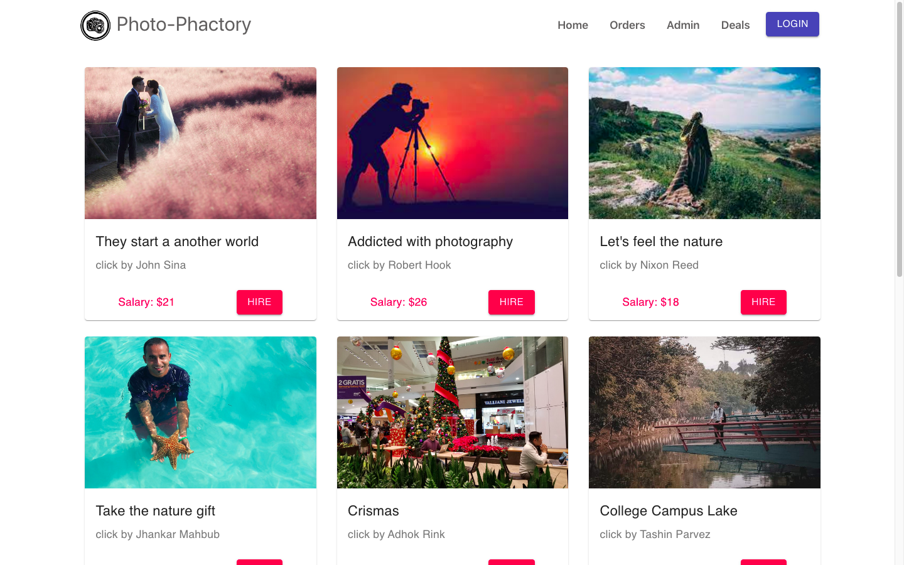

# ima-zon-simple-client
#### full stack website where user can hire user.
### [Live website](https://photo-phactoryy.web.app/)  |  [Live API server](https://blueberry-surprise-50914.herokuapp.com/photos)

## Feautures
+ User can buy photographer 
+ login admin can add photo and photographer also manage data
+ user must need to login than can access everything without admin panel
+ after order user can see his all orders from the orders nav.

## Front-end Technology :
+ React.js
+ Bootstrap5
+ Material-ui

## Back-end Technology :
+ Node.js
+ Express.js
+ MongoDB
+ Firebase Authentication

### [Back-end Repository](https://github.com/Porgramming-Hero-web-course/full-stack-server-ShahinurAlamBhuiyan)

## Let's take a look!

